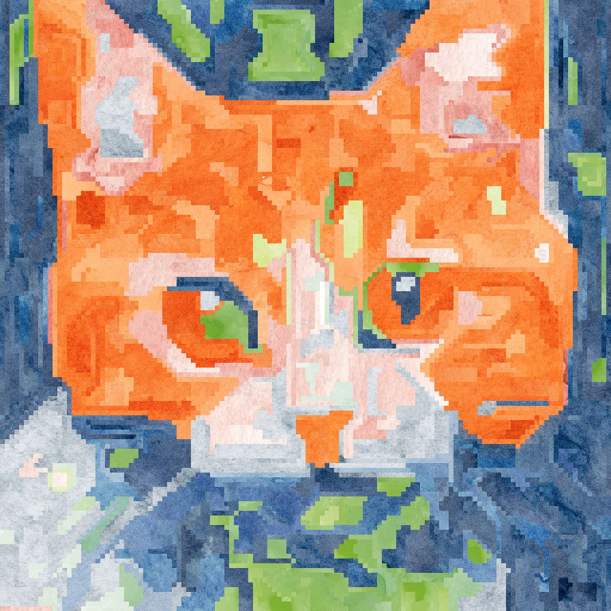

# SDXL CollageNet

Diffusion-time region-based collage rendering for SDXL.

This project guides SDXL generation with a bank of reference image latents, then reconstructs a sharp collage-style final image from the original source pixels.

The recommended region method is `felzenszwalb`.

## Core Idea

Instead of stylizing only after generation, this project interrupts SDXL during denoising:

1. Read the current latent.
2. Segment it into regions.
3. Sample same-size candidate windows from a reference latent bank.
4. Score candidates with masked cosine similarity in latent space.
5. Blend the best-matching region back into the latent.
6. Continue denoising.

After diffusion, the final assignment map is used to render a sharp pixel collage from the original source images.

## Quick Start

Start from the default YAML config:

```bash
python render.py --config configs/default.yaml
```

YAML keys use `snake_case`. CLI overrides prefer `kebab-case`, for example:

- YAML: `felzenszwalb_sigma`
- CLI: `--felzenszwalb-sigma`

For convenience, the CLI also accepts underscore-style flags such as `--felzenszwalb_sigma`.

You can also override the main knobs directly from the command line:

```bash
python render.py \
  --prompt "a cute cat" \
  --source-images ./watercolors \
  --output-dir ./outputs/cute-cat
```

Example with explicit latent input and tuned `felzenszwalb` settings:

```bash
python render.py \
  --config configs/default.yaml \
  --output-dir test \
  --prompt "a cute cat" \
  --source-latents watercolor-latents/ \
  --felzenszwalb-min-size 8 \
  --felzenszwalb-sigma 1.2
```

Example output:



To render a seed batch:

```bash
python render.py \
  --config configs/default.yaml \
  --num-seeds 8 \
  --seed-offset 16 \
  --output-dir ./outputs/seed-batch
```

This saves:

- `a_cute_cat__projection_start_frac_0_6__do_rotated_true_seed_0016_ab12cd34.png`
- `a_cute_cat__projection_start_frac_0_6__do_rotated_true_seed_0017_ef56gh78.png`
- ...

By default, only the final displayed image is saved.
If `generation.output_stem` is not set, filenames are auto-generated from the prompt, CLI overrides, seed, and a random suffix so repeated runs do not overwrite older images.

## Input Sources

You can provide either:

- `source.source_latents`
  - a single `.npz` latent file or a directory of `.npz` files
- `source.source_images`
  - a single image file or a directory of source images

If you pass source images, `render.py` will encode them to temporary SDXL VAE latents automatically before building the patch bank.

If you want to precompute latents yourself:

```bash
python prepare-patches.py ./images ./latents
```

## Project Layout

- `render.py`
  - command-line renderer
  - YAML config + CLI overrides
  - multi-seed output loop
- `render_config.py`
  - structured config dataclasses
  - YAML loading
- `render_runtime.py`
  - pipeline loading
  - patch bank creation
  - projector construction
  - final image saving
- `patch_dictionary_core.py`
  - core matching, region projection, and collage rendering logic
- `source_latents.py`
  - reusable source-image-to-latent preparation helpers
- `prepare-patches.py`
  - standalone latent preprocessing script
- `main.ipynb`
  - notebook demo / hackable playground

## Region Methods

Publicly supported methods:

- `felzenszwalb`
  - recommended default
- `threshold`
  - optional alternative for experimentation
- `square`
  - square patch baseline

## Config Guide

The YAML config is split into `model`, `source`, `generation`, `projection`, and `output`.

The usual SDXL controls like image size, inference steps, and guidance scale work the way you would expect, so the notes below focus on the collage-specific settings.

### `source`

- `source_images`
  - Path to a source image file or directory.
  - These images are encoded to SDXL VAE latents before rendering.
- `source_latents`
  - Path to a latent `.npz` file or a directory of latent files.
  - Use this when you want faster repeated renders and do not want to re-encode images each run.
- `recursive`
  - If `true`, searches nested subdirectories when loading source images.
- `max_width`, `max_height`
  - Optional preprocessing caps for source images before VAE encoding.
  - Useful when your source images are very large and you want a smaller latent bank.
- `encode_mode`
  - Controls how source images are encoded into latents.
  - `mean` is the default and is the most stable choice for building a reusable source bank.

### `generation`

- `seed`
  - Base seed for rendering.
- `num_seeds`
  - Number of consecutive seeds to render in one CLI call.
- `seed_offset`
  - Offset added to the base seed before the batch starts.
  - Useful for continuing a sweep without changing the main seed.
- `output_stem`
  - Optional base filename used for single-image runs and auxiliary outputs.
  - If omitted, the renderer saves files like `{formatted_prompt}__{override_tokens}_seed_{seed}_{random_id}.png`.
- `pixel_render_scale`
  - Upscales the final sharp collage render by an integer factor.
  - This affects only the saved collage-style output, not the diffusion process itself.

### `projection`

- `region_method`
  - Chooses how the live latent is divided before matching.
  - Recommended: `felzenszwalb`
  - Alternatives: `threshold`, `square`
- `patch_size`
  - Patch size in latent cells.
  - `1` means the dictionary is built from individual latent cells, which is the current default and works well with region projection.
- `do_rotated`
  - If `true`, augments the source patch bank with 90 degree rotations.
  - This can improve matching diversity without requiring more source images.
- `total_patches`
  - Total number of dictionary patches sampled into the reference bank.
  - Larger values improve coverage but increase memory use and lookup cost.
- `top_k`
  - Number of nearest dictionary patches mixed together for square-patch matching.
  - In the current setup this is usually left at `1`.
- `dictionary_chunk_size`
  - Chunk size used when searching the reference bank.
  - This mainly trades memory for speed during cosine search.
- `similarity_temperature`
  - Temperature used when turning top-k similarity scores into soft weights.
  - Lower values make the projection behave more like a hard nearest-neighbor choice.
- `random_seed`
  - Seed used when sampling patches from the source bank and when sampling region candidates from references.
  - This is separate from the diffusion seed.

### Projection Schedule

- `projection_start_frac`
  - Fraction of the denoising trajectory where collage projection starts.
  - Example: `0.7` means projection begins in the final 30 percent of steps.
- `projection_end_frac`
  - Fraction of the denoising trajectory where projection stops.
  - Usually this is `1.0` so projection continues to the end.
- `projection_every_n_steps`
  - Applies projection only every N denoising steps.
  - `1` means project at every eligible step.
- `alpha_start`
  - Blend strength at the start of the projection window.
- `alpha_end`
  - Blend strength at the end of the projection window.
  - Higher values force stronger source-image structure into the result.

### Region Matching

- `region_candidate_count`
  - Number of random same-size candidate windows sampled from the source bank for each region.
  - Higher values improve match quality but cost more compute.
- `region_min_area`, `region_max_area`
  - Filters region sizes in latent-cell units.
  - These are useful for rejecting tiny fragments or huge regions that are not helpful to match.
- `region_max_bbox_h`, `region_max_bbox_w`
  - Optional hard caps on region bounding-box size in latent cells.
  - `0` disables the cap.
- `debug_every_n_projections`
  - Saves a region debug image every N projection events when auxiliary outputs are enabled.
- `preview_every_n_projections`
  - Controls optional stored latent previews during notebook-style experimentation.
  - This is mainly useful for debugging and can usually stay at `0`.

### `felzenszwalb`

- `felzenszwalb_scale`
  - Main region-size knob for the default segmentation method.
  - Larger values generally encourage larger merged regions, though the effect depends on the latent structure.
- `felzenszwalb_sigma`
  - Smoothing applied before segmentation.
  - Higher values produce smoother, less detailed region boundaries.
- `felzenszwalb_min_size`
  - Minimum region size enforced by the segmenter.
  - Raising this removes small regions and simplifies the collage.

### `threshold`

- `threshold_min_regions`, `threshold_max_regions`
  - Target range for the threshold-based segmentation method.
  - The code searches for a similarity threshold that lands inside this range if possible.
- `threshold_connectivity`
  - Neighborhood connectivity used during region merging.
  - `4` is more conservative; `8` allows diagonal connections.
- `threshold_similarity_low`, `threshold_similarity_high`
  - Search bounds for the latent-space similarity threshold.
  - These usually do not need frequent changes unless you are tuning the threshold method directly.

### `output`

- `output_dir`
  - Where rendered images are saved.
- `save_auxiliary_outputs`
  - If `true`, also saves metadata, region assignments, and debug renders.
  - If `false`, saves only the final image.
- `save_displayed_image`
  - If `true`, saves the sharp collage render when available.
  - If `false`, saves the raw VAE-decoded diffusion image instead.

## Recommended Starting Settings

These are solid current defaults:

```yaml
projection:
  region_method: "felzenszwalb"
  patch_size: 1
  total_patches: 20000
  region_candidate_count: 128
  alpha_start: 0.0
  alpha_end: 0.1
  projection_start_frac: 0.7
  projection_end_frac: 1.0
  felzenszwalb_scale: 32.0
  felzenszwalb_sigma: 0.8
  felzenszwalb_min_size: 8
```

## Optional LoRA

The default config does not enable any LoRA.

If you want one, set these fields in `model`:

- `lora_repo`
- `lora_weight_name`
- `embedding_filename`
- `embedding_token`

If your LoRA also needs textual inversion embeddings, `render.py` will load them when those fields are provided.
